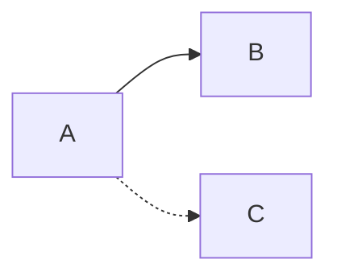
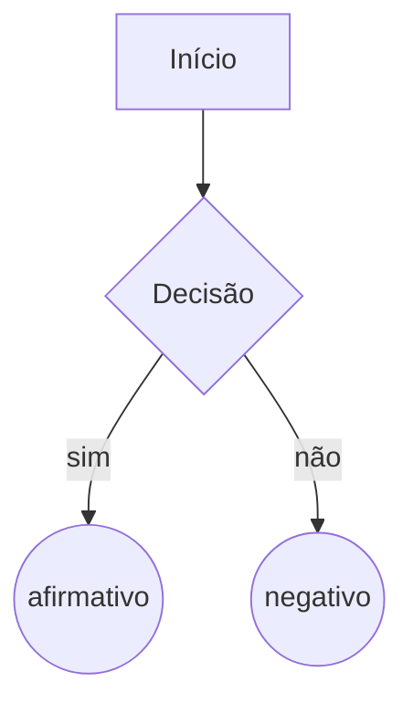

[TOC]

Elaborado no Typora

# Formatação

Negrito: **negrito** 

Itálico: *itálico*

negrito e itálico: **_destaque_ **

# Tabelas

| Item 1 | Item 2 | Item 3 |
| :----: | :----: | :----: |
|   a    |   b    |   c    |
|   d    |   e    |   f    |

# Fluxogramas

# Equações

$$
\nabla\times\mathbf{E}=-\frac{\part \mathbf{B}}{\part t} \label{eq1}\tag{1}
$$

$$
\nabla\times\mathbf{H}=J+\frac{\part \mathbf{D}}{\part t} \label{eq2}\tag{2}
$$

$$
\nabla\cdot\mathbf{D}=\rho_v \label{eq3}\tag{3}
$$

$$
\nabla\cdot\mathbf{B}=0 \label{eq4}\tag{4}
$$

$ \mathbf{D}=\epsilon_0\mathbf{E}+\mathbf{P} $			$\mathbf{B}=\mu_0\mathbf{H}+\mathbf{M}$			$\mathbf{J}=\sigma\mathbf{E}$

## Equações de Maxwell:

- Lei de Faraday $\ref{eq1}$
- Lei de Ampère-Maxwell $\ref{eq2}$
- Lei de Gauss $\ref{eq3}$
- Lei de Gauss Magnetismo $\ref{eq4}$

# Figura da Internet

